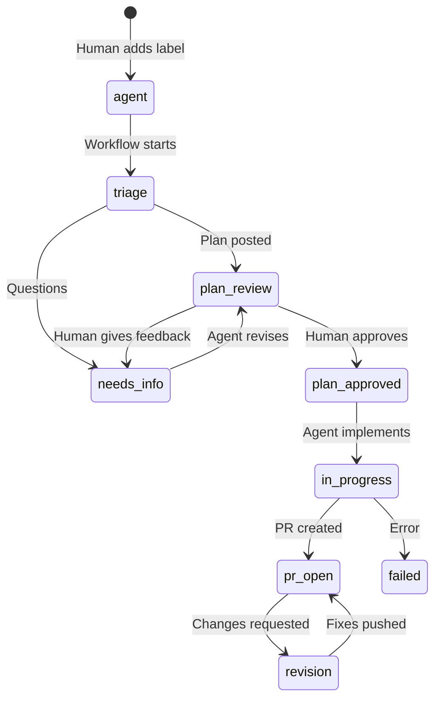
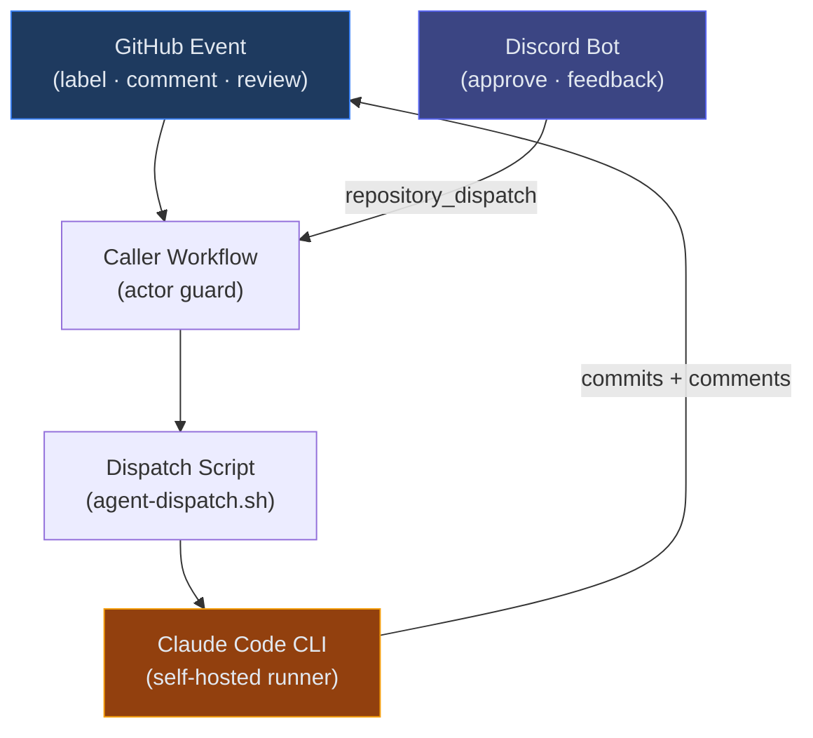

# Slide Deck Improvements Implementation Plan

> **For agentic workers:** REQUIRED SUB-SKILL: Use superpowers:subagent-driven-development (recommended) or superpowers:executing-plans to implement this plan task-by-task. Steps use checkbox (`- [ ]`) syntax for tracking.

**Goal:** Improve the Slidev presentation deck with professional styling, expanded content slides, fixed diagrams, and refined positioning — while keeping the 30-minute time budget.

**Architecture:** Stay on the `default` theme for full control, add comprehensive custom `style.css` (dark background, gradient accents, polished tables/code), switch fonts to Inter + JetBrains Mono, add global components for persistent decorations, configure Mermaid dark theming. Restructure existing slides to fix diagram cutoff issues, and add 4 new content slides (requirements, expanded comparison, file layout, benefits). Additional talking points are woven into existing slides or speaker notes.

**Tech Stack:** Slidev (default theme), custom CSS, Inter/JetBrains Mono, Mermaid (dark), UnoCSS

**Location:** `E:/DemoPresentations/`

---

## Slide Deck Overview — Before & After

### Current (14 slides):
1. Title
2. The Problem
3. What If?
4. Label State Machine (diagram cut off)
5. Architecture (diagram cut off)
6. Safety & Guardrails
7. How Is This Different? (3-column, missing claude-code-action)
8. Demo Time
9. What You're About to See
10. Same System, Different Project
11. How Fast Can You Set This Up?
12. Getting Started
13. Open Source / Q&A

### Proposed (17 slides):
1. Title
2. The Problem
3. What If? + Positioning *(add "what this is / isn't" callouts)*
4. Label State Machine *(fix diagram scaling)*
5. Architecture *(fix diagram scaling)*
6. **Where the Files Live** *(NEW — deployment layout)*
7. Safety & Guardrails
8. How Is This Different? *(expand to 4 columns, add claude-code-action)*
9. **What You Need** *(NEW — requirements)*
10. Demo Time
11. What You're About to See
12. Same System, Different Project
13. How Fast Can You Set This Up?
14. Getting Started
15. **Why This Matters** *(NEW — benefits: history, context, CI/CD analogy)*
16. Open Source / Q&A

Net: +3 slides (14 → 17). Time impact: ~1-2 minutes of additional slide content, offset by tighter transitions.

---

## Talking Points Placement

| Talking Point | Placement |
|---|---|
| Not a replacement for interactive mode | Slide 3 (What If?) — subtitle callout + speaker note |
| Not a replacement for OpenClaw | Slide 8 (comparison table) — implicit via table + speaker note |
| Maintains working history of issue/feature | Slide 15 (Why This Matters) — bullet point |
| Reduces context strain/overload | Slide 15 (Why This Matters) — bullet point |
| Like CI/CD — gets better with use | Slide 15 (Why This Matters) — bullet point |

---

### Task 1: Add professional dark styling, fonts, and global components

**Files:**
- Modify: `E:/DemoPresentations/slides.md` (frontmatter only)
- Create: `E:/DemoPresentations/style.css` (global custom styles)
- Create: `E:/DemoPresentations/global-top.vue` (gradient accent bar)

Stay on the `default` theme for full control. Add Inter + JetBrains Mono fonts, dark color scheme, gradient accents, polished table/code styling, Mermaid dark config, and a persistent top accent bar.

- [ ] **Step 1: Update the frontmatter in slides.md**

Replace the existing frontmatter block (lines 1-11) with:

```yaml
---
theme: default
title: "Claude Agent Dispatch"
info: |
  An Open-Source Agent Orchestrator Built on GitHub Actions
class: text-center
drawings:
  persist: false
transition: fade
mdc: true
fonts:
  sans: Inter
  mono: JetBrains Mono
  provider: google
highlighter: shiki
lineNumbers: false
mermaid:
  theme: dark
  themeVariables:
    primaryColor: '#1e40af'
    primaryTextColor: '#e2e8f0'
    primaryBorderColor: '#3b82f6'
    secondaryColor: '#1e293b'
    lineColor: '#60a5fa'
    textColor: '#e2e8f0'
    fontFamily: 'Inter, sans-serif'
---
```

Key changes: Inter + JetBrains Mono fonts, `transition: fade`, Mermaid dark theme variables, Shiki highlighter.

- [ ] **Step 2: Create comprehensive global styles**

Create `E:/DemoPresentations/style.css`:

```css
/* ===== THEME VARIABLES ===== */
:root {
  --slidev-theme-primary: #2563eb;
  --slidev-slide-container-background: #0f172a;
  --slidev-transition-duration: 0.4s;

  /* Code blocks */
  --slidev-code-background: #1e293b;
  --slidev-code-foreground: #e2e8f0;
  --slidev-code-font-size: 14px;
  --slidev-code-line-height: 22px;
  --slidev-code-radius: 8px;
  --slidev-code-padding: 16px;
  --slidev-code-margin: 8px 0;
}

/* ===== DARK SLIDE BACKGROUND ===== */
.slidev-layout {
  background: linear-gradient(180deg, #0f172a 0%, #131c2e 100%);
  color: #e2e8f0;
}

/* ===== TYPOGRAPHY ===== */
.slidev-layout h1 {
  color: #60a5fa;
  font-weight: 700;
  letter-spacing: -0.02em;
}

.slidev-layout h2 {
  color: #93c5fd;
  font-weight: 600;
}

.slidev-layout h3 {
  color: #bfdbfe;
}

.slidev-layout li strong {
  color: #60a5fa;
}

.slidev-layout li {
  line-height: 2;
}

/* ===== COVER / SECTION SLIDES ===== */
.slidev-layout.cover,
.slidev-layout.section {
  background: linear-gradient(135deg, #0f172a 0%, #1a1a3e 50%, #1e293b 100%);
}

.slidev-layout.cover h1 {
  font-size: 3.5rem;
  background: linear-gradient(135deg, #60a5fa, #a78bfa);
  -webkit-background-clip: text;
  -webkit-text-fill-color: transparent;
  background-clip: text;
}

/* ===== CODE BLOCKS ===== */
.slidev-code {
  border: 1px solid rgba(59, 130, 246, 0.15);
  box-shadow: 0 4px 12px rgba(0, 0, 0, 0.25);
}

/* ===== TABLES ===== */
.slidev-layout table {
  font-size: 0.85em;
}

.slidev-layout th {
  background: rgba(37, 99, 235, 0.12);
  color: #93c5fd;
  font-weight: 600;
}

.slidev-layout td, .slidev-layout th {
  padding: 0.4em 0.6em;
  border-color: rgba(148, 163, 184, 0.12);
}

/* ===== LINKS ===== */
.slidev-layout a {
  color: #60a5fa;
  text-decoration: none;
  border-bottom: 1px dashed #60a5fa;
}

/* ===== BLOCKQUOTES ===== */
.slidev-layout blockquote {
  background: rgba(37, 99, 235, 0.08);
  border-left-color: #2563eb;
}

/* ===== MERMAID SIZING ===== */
.mermaid {
  max-height: 75vh;
}

/* ===== CALLOUT BOXES ===== */
.callout {
  background: rgba(59, 130, 246, 0.1);
  border-left: 3px solid #3b82f6;
  padding: 0.75em 1em;
  border-radius: 0 6px 6px 0;
  margin: 0.5em 0;
}
.callout-amber {
  background: rgba(245, 158, 11, 0.1);
  border-left: 3px solid #f59e0b;
  padding: 0.75em 1em;
  border-radius: 0 6px 6px 0;
  margin: 0.5em 0;
}
```

- [ ] **Step 3: Create the global top accent bar**

Create `E:/DemoPresentations/global-top.vue`:

```vue
<template>
  <div class="absolute top-0 left-0 right-0 h-1 bg-gradient-to-r from-blue-600 to-violet-600" />
</template>
```

This renders a persistent blue-to-violet gradient line at the top of every slide.

- [ ] **Step 4: Build and verify the styling**

```bash
cd E:/DemoPresentations
npx slidev build
```

Expected: Build succeeds. Slides have dark background, blue headings, gradient accent bar, Inter font, polished code blocks.

- [ ] **Step 5: Commit**

```bash
cd E:/DemoPresentations
git add slides.md style.css global-top.vue
git commit -m "feat: add professional dark styling with Inter font and gradient accents"
```

---

### Task 2: Fix the Label State Machine diagram (slide 4)

**Files:**
- Modify: `E:/DemoPresentations/slides.md` (state machine slide)

The current diagram is cut off at the bottom. Fix by reducing the scale and simplifying state names.

- [ ] **Step 1: Replace the state machine slide content**

Find the slide that starts with `# Label State Machine` and replace the entire slide (from `---` before it to `---` after the speaker note closing `-->`) with:

```markdown
---
layout: default
---

# Label State Machine



<div class="text-xs opacity-50 mt-1">GitHub labels use the <code>agent:</code> prefix (e.g. <code>agent:plan-review</code>)</div>

<!--
The core of the system is a label state machine on GitHub issues. Each label represents a stage in the lifecycle. The key transition is plan-review to plan-approved — that's the human checkpoint. No code gets written until a human approves the plan. The agent:needs-info state can happen at two stages: during triage (agent asks clarifying questions) and during plan review (human gives feedback on the plan).
-->
```

Key changes: scale reduced from 0.75 to 0.55, added `theme: 'dark'` for Mermaid, shortened state names, added `needs_info → plan_review` (feedback revision loop).

- [ ] **Step 2: Build and verify diagram fits**

```bash
cd E:/DemoPresentations && npx slidev build
```

Expected: State machine diagram fully visible with no cutoff.

- [ ] **Step 3: Commit**

```bash
cd E:/DemoPresentations
git add slides.md
git commit -m "fix: reduce state machine diagram scale to prevent cutoff"
```

---

### Task 3: Fix the Architecture diagram (slide 5)

**Files:**
- Modify: `E:/DemoPresentations/slides.md` (architecture slide)

The current flowchart is cut off on the right. Fix by switching to a top-down layout and reducing scale.

- [ ] **Step 1: Replace the architecture slide content**

Find the slide that starts with `# Architecture` and replace the entire slide with:

```markdown
---
layout: default
---

# Architecture



<!--
The event flow: a GitHub event triggers a workflow, which calls the dispatch script, which invokes Claude Code on your self-hosted runner. The Discord bot is a separate entry point — when you approve from Discord, it fires a repository_dispatch event that enters the same pipeline. Your code never leaves your infrastructure. The only thing that crosses the network boundary is the LLM API call.
-->
```

Key changes: switched from `LR` (left-right) to `TD` (top-down) to fit screen width, reduced scale from 0.7 to 0.6, added dark-compatible node styles, removed the intermediate "Reusable Workflow" box to reduce width.

- [ ] **Step 2: Build and verify diagram fits**

```bash
cd E:/DemoPresentations && npx slidev build
```

Expected: Architecture diagram fully visible, no right-side cutoff.

- [ ] **Step 3: Commit**

```bash
cd E:/DemoPresentations
git add slides.md
git commit -m "fix: switch architecture diagram to top-down layout to prevent cutoff"
```

---

### Task 4: Add "Where the Files Live" slide (NEW — slide 6)

**Files:**
- Modify: `E:/DemoPresentations/slides.md` (insert after architecture slide)

This slide shows the deployment layout — which files live in the target repo vs. the runner machine. Uses a two-column layout.

- [ ] **Step 1: Insert the new slide after the Architecture slide**

After the architecture slide's closing `-->`, insert:

```markdown
---
layout: two-cols
layoutClass: gap-8
---

# Where the Files Live

**Your Project Repo:**

```
my-project/
├── .github/workflows/
│   └── agent-*.yml     ← trigger workflows
├── .agent-dispatch/     ← standalone only
│   ├── scripts/
│   ├── prompts/
│   └── config.env
├── CLAUDE.md            ← project context
└── (your code)
```

::right::

<div class="mt-12">

**Self-Hosted Runner:**

```
~/agent-infra/           ← reference mode
├── scripts/
├── prompts/
├── config.env
└── discord-bot/         ← optional

~/.claude/worktrees/     ← runtime
└── my-project-issue-42/ ← ephemeral
```

</div>

<!--
Two deployment modes. Reference mode: thin workflow files in your repo call upstream, scripts live on the runner. Standalone mode: everything copied into your repo — you own it all. In both cases, worktrees are created fresh per issue and cleaned up after. The Discord bot is a separate process on the runner, not part of the GitHub Actions workflows.
-->
```

- [ ] **Step 2: Build and verify two-column layout renders**

```bash
cd E:/DemoPresentations && npx slidev build
```

Expected: Two-column slide with file trees side by side.

- [ ] **Step 3: Commit**

```bash
cd E:/DemoPresentations
git add slides.md
git commit -m "feat: add 'Where the Files Live' deployment layout slide"
```

---

### Task 5: Expand comparison slide to 4 columns (slide 8)

**Files:**
- Modify: `E:/DemoPresentations/slides.md` (comparison table slide)
- Modify: `E:/DemoPresentations/speaker-notes.md` (update Q&A section)

Add `claude-code-action` as a fourth comparison column. Restructure the table rows for clarity at presentation scale.

- [ ] **Step 1: Replace the comparison slide**

Find the slide starting with `# How Is This Different?` and replace the entire slide with:

```markdown
---
layout: default
---

# How Is This Different?

<div class="text-sm">

| | Copilot Agent | claude-code-action | OpenClaw | **Agent Dispatch** |
|---|---|---|---|---|
| **Type** | Built-in GitHub agent | GitHub Action (stateless) | AI assistant platform | Issue-to-PR orchestrator |
| **Open source** | No | Yes (MIT) | Yes | Yes (MIT) |
| **Self-hosted** | No | Yes | Yes | Yes |
| **Auth model** | GitHub sub + premium req. | API key (multi-provider) | Any LLM API | Claude Pro/Max sub |
| **Approval gate** | No | No | N/A | **Two-phase** |
| **Lifecycle** | Single-phase | Stateless | N/A for coding | **Full state machine** |
| **Data sovereignty** | GitHub infra | Your infra | Your infra | Your infra |

</div>

<!--
Four tools you might compare this to. Key distinction: claude-code-action is Anthropic's official GitHub Action — excellent for stateless PR interactions like @claude mentions and one-off reviews. Agent Dispatch builds on the Claude Code CLI to add a full lifecycle: triage, plan, approve, implement, review. Think of claude-code-action as "ask Claude a question" and Agent Dispatch as "assign Claude a project." Copilot Agent is the convenience play — zero setup, but no customization and no approval gate. OpenClaw is a general-purpose assistant platform — 24+ messaging channels — but issue-to-PR is not its focus.
-->
```

- [ ] **Step 2: Update speaker notes with claude-code-action Q&A**

In `E:/DemoPresentations/speaker-notes.md`, find the `## Slide 7: Alternatives` section and add after the existing Q&A entries:

```markdown
### "How is this different from claude-code-action?"
claude-code-action is Anthropic's official GitHub Action and it's excellent for quick PR interactions — @claude mentions, one-off reviews, simple fixes. The difference is lifecycle. claude-code-action is stateless — each invocation is fresh, no memory between runs. Agent Dispatch manages a multi-phase lifecycle with persistent state (worktrees, labels), human checkpoints, and a notification layer. They're complementary: claude-code-action is "ask Claude a question on a PR," Agent Dispatch is "assign Claude a project and manage it through completion."
```

- [ ] **Step 3: Build and verify table renders at readable size**

```bash
cd E:/DemoPresentations && npx slidev build
```

Expected: 5-column table readable with the `text-sm` wrapper.

- [ ] **Step 4: Commit**

```bash
cd E:/DemoPresentations
git add slides.md speaker-notes.md
git commit -m "feat: expand comparison table with claude-code-action column"
```

---

### Task 6: Add "What You Need" requirements slide (NEW — slide 9)

**Files:**
- Modify: `E:/DemoPresentations/slides.md` (insert after comparison slide)

This slide concisely covers prerequisites. Uses icon-style bullet groups.

- [ ] **Step 1: Insert the requirements slide after the comparison slide**

After the comparison slide's closing `-->`, insert:

```markdown
---
layout: default
---

# What You Need

<div class="grid grid-cols-2 gap-6 mt-4">
<div>

<div class="callout">

**Infrastructure**
- A Linux machine (home server, VPS, cloud)
- GitHub Actions self-hosted runner
- Claude Code CLI + Anthropic API key

</div>

<div class="callout mt-4">

**GitHub**
- Organization account *(branch protection rules)*
- Bot account with fine-grained PAT
- `AGENT_PAT` repo secret

</div>

</div>
<div>

<div class="callout">

**Claude Account**
- Claude Max subscription *(recommended)*
- Or Anthropic API key with model access
- Provides: `claude` CLI in headless mode

</div>

<div class="callout-amber mt-4">

**Optional**
- Discord server + bot for mobile approvals
- Classic PAT with `gist` scope for cleanup

</div>

</div>
</div>

<!--
Let's walk through what you actually need. A Linux machine — anything from a Raspberry Pi to an EC2 instance — with a self-hosted GitHub runner. A GitHub organization is recommended because it gives you branch protection rules that require human review of bot PRs. A dedicated bot account keeps the actor filter clean — if you reuse your own account, your actions get filtered too. Claude Max subscription is the simplest auth path — the CLI just works. Discord is optional but lets you approve plans from your phone.
-->
```

- [ ] **Step 2: Build and verify the grid layout**

```bash
cd E:/DemoPresentations && npx slidev build
```

Expected: 2x2 grid of callout boxes with blue and amber accents.

- [ ] **Step 3: Commit**

```bash
cd E:/DemoPresentations
git add slides.md
git commit -m "feat: add 'What You Need' requirements slide"
```

---

### Task 7: Update "What If?" slide with positioning callout (slide 3)

**Files:**
- Modify: `E:/DemoPresentations/slides.md` (What If? slide)

Add a subtle callout below the vision statement clarifying what this is NOT.

- [ ] **Step 1: Replace the What If? slide**

Find the slide starting with `# What If?` and replace the entire slide with:

```markdown
---

# What If?

<div class="text-2xl mt-8 leading-relaxed">

A system that **triages**, **plans**, gets **approval**, **implements**, and handles **review feedback** — autonomously, on any project.

</div>

<div class="mt-8 text-sm opacity-60">

Not a replacement for interactive Claude Code sessions. Not a general-purpose assistant.<br/>
A focused pipeline: **issue in, pull request out.**

</div>

<!--
That's what we built. Important framing: this is not meant to replace you sitting down with Claude Code and working through a problem interactively. That's still the best workflow for exploratory work, design decisions, and complex debugging. This is for the well-defined issues in your backlog that you'd love to hand off overnight. It's also not an OpenClaw-style assistant — it won't do your laundry or manage your calendar. It does one thing: turn GitHub issues into pull requests.
-->
```

- [ ] **Step 2: Build and verify**

```bash
cd E:/DemoPresentations && npx slidev build
```

- [ ] **Step 3: Commit**

```bash
cd E:/DemoPresentations
git add slides.md
git commit -m "feat: add positioning callout to What If slide"
```

---

### Task 8: Add "Why This Matters" benefits slide (NEW — slide 15)

**Files:**
- Modify: `E:/DemoPresentations/slides.md` (insert before the Open Source closing slide)

This slide captures the CI/CD analogy, context reduction, and history benefits.

- [ ] **Step 1: Insert the benefits slide before the Open Source slide**

Find the slide starting with `# Open Source` and insert before its `---`:

```markdown
---

# Why This Matters

<v-clicks>

- **Working history** — Every decision, plan revision, and code change is captured in the issue and PR. Nothing gets lost between sessions.
- **Context stays manageable** — Each agent session is fresh, but the issue thread preserves full context. No more 200k-token conversations that drift.
- **Like any CI/CD pipeline** — The more you use it, the better it gets. Your CLAUDE.md improves, your prompts get refined, your test gates catch more.
- **Async by default** — Label an issue before bed, wake up to a PR. Your agent works your backlog while you sleep.

</v-clicks>

<!--
These are the compounding benefits. The working history point is subtle but important — when you work with Claude interactively, the conversation disappears when you close the terminal. Here, every plan, every revision, every code review comment is permanently captured in the GitHub issue. Context management is the other big win — instead of one massive conversation that loses coherence at 100k tokens, each agent invocation is a fresh session with just the right context loaded from the issue and CLAUDE.md. And like any pipeline, it improves over time as you tune your project's CLAUDE.md and prompts.
-->
```

- [ ] **Step 2: Build and verify**

```bash
cd E:/DemoPresentations && npx slidev build
```

- [ ] **Step 3: Commit**

```bash
cd E:/DemoPresentations
git add slides.md
git commit -m "feat: add 'Why This Matters' benefits slide"
```

---

### Task 9: Final build verification and commit

**Files:**
- All files in `E:/DemoPresentations/`

- [ ] **Step 1: Full clean build**

```bash
cd E:/DemoPresentations && npx slidev build
```

Expected: Build succeeds with 17 slides total, all Mermaid diagrams render, no errors.

- [ ] **Step 2: Verify slide count**

```bash
grep -c "^---" E:/DemoPresentations/slides.md
```

Expected: approximately 21-23 separators (frontmatter + slide separators for 17 slides).

- [ ] **Step 3: Final commit if any uncommitted changes**

```bash
cd E:/DemoPresentations
git add -A
git commit -m "chore: final verification pass on slide deck improvements"
```

---

## Research Notes (for reference during implementation)

### Theme Choice: Stay on `default` with custom CSS
- Staying on the default theme gives full control without fighting theme opinions
- Custom `style.css` provides: dark gradient backgrounds, blue accent headings, polished tables/code, callout boxes
- Inter + JetBrains Mono fonts (via Google Fonts) for clean engineering aesthetic
- `global-top.vue` adds a persistent gradient accent bar across all slides
- Mermaid dark theme configured via frontmatter `themeVariables`
- Considered `seriph` (official, serif typography) and `geist` (Vercel-inspired) but custom CSS on default gives the best balance of control and polish
- Code font bumped to 14px for screenshare readability (default 12px is too small)

### Alternatives Comparison Accuracy Notes
- **OpenClaw star count:** Speaker notes previously said "250k stars" — could not verify. Use "massive community" instead of specific numbers.
- **Copilot Agent premium pricing:** Verify $0.04/request rate is still current before April 2.
- **claude-code-action:** Confirmed MIT license, ~6.7k stars, supports 4 auth providers (Anthropic, Bedrock, Vertex, Foundry).
- **claude-code-action vs agent-dispatch:** Complementary, not competing. Action is stateless building block, dispatch is stateful lifecycle.

### Requirements Summary (from codebase research)
- **Linux machine:** Required for self-hosted runner. Can be VPS, home server, cloud.
- **Claude account:** Claude Max subscription recommended (CLI works directly). Or Anthropic API key.
- **GitHub org:** Recommended (not required) for branch protection rules requiring PR review.
- **Bot account:** Strongly recommended. Actor filter (`github.actor != 'bot'`) prevents infinite loops. If you reuse your own account, your manual actions also get filtered.
- **Fine-grained PAT:** Scoped to Contents, Issues, Pull Requests, Metadata on target repos.
- **Software on runner:** Node.js 18+, Claude CLI, gh CLI, git, jq, curl.
- **Discord bot:** Optional. Python 3.10+, discord.py, systemd service.

### File Layout (from codebase exploration)
- **Reference mode:** Thin caller workflows in target repo → call upstream reusable workflows. Scripts, prompts, config live on runner at `~/agent-infra/`.
- **Standalone mode:** Everything copied into target repo under `.agent-dispatch/`. Full ownership, no upstream dependency.
- **Both modes:** Worktrees created at `~/.claude/worktrees/` per issue (ephemeral). Discord bot runs as separate systemd service.
